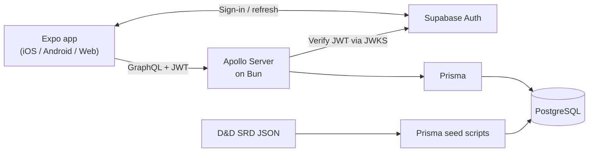

# 5e Companion

A full-stack, cross-platform companion app for Dungeons & Dragons 5th Edition. Players can:

- Browse, create and manage characters and classes
- Track and manage everything you'd have on a physical character sheet - HP, spells, equipment, death saves, insipiration, etc.
- Easily level up characters with the interactive wizard

This is a personal project under active development, primarily being used as a playground to learn about the different parts of the tech stack and explore different AI models and AI-assisted engineering workflows. Current limitations and planned work are documented in [the project overview](docs/overview.md).

## Tech stack

| Area | Technologies |
| --- | --- |
| Client | React Native, Expo, Expo Router, TypeScript, Apollo Client, React Native Paper |
| API | Bun, Apollo Server, GraphQL |
| Data | PostgreSQL, Prisma, D&D 5e SRD seed data |
| Authentication | Supabase Auth, JWT, JWKS |
| Testing | Jest, Bun test, Playwright |
| Deployment | GitHub Actions, Docker, Cloudflare Pages, Automated Deployments

## Architecture



The web client is deployed to Cloudflare Pages. The API runs as a Dockerised Bun service behind Caddy on a VPS. See the [deployment guide](docs/deployment.md) for details.

## Run locally

Install [Bun](https://bun.sh) and Yarn, then create the environment files described in the [local development guide](docs/local-development.md).

```bash
bun setup
docker compose -f server/docker-compose.yml up -d
bun db:seed
bun server:start
bun app:start
```

The API runs on port 4000; Expo starts the app for web, iOS, or Android. The full guide covers environment variables, database migrations, tests, and troubleshooting.

## Full Documentation Links

- [Architecture](docs/architecture.md)
- [Data model](docs/data-model.md)
- [Mobile app](docs/mobile-app.md)
- [Server](docs/server.md)
- [Testing](docs/testing.md)
- [Deployment](docs/deployment.md)
