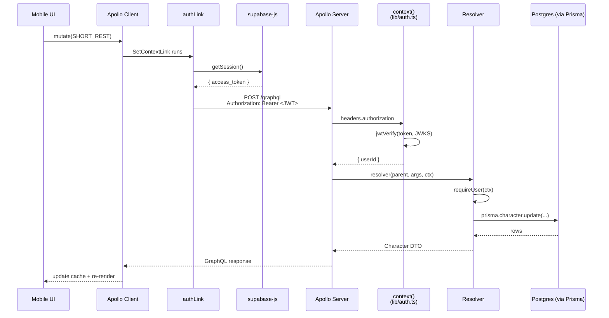
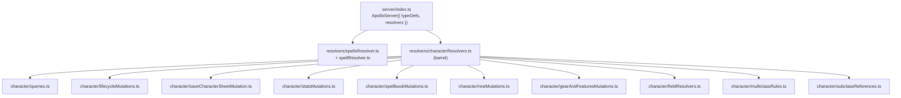
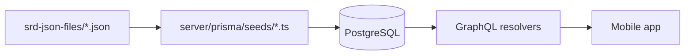
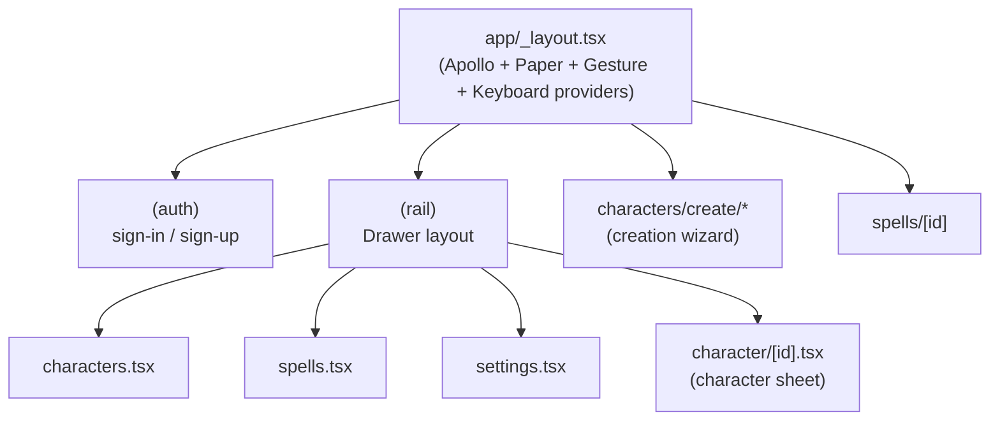

# Architecture

## Components

- **Mobile app** — `mobile-app/`, Expo React Native, targets iOS/Android/Web from one codebase.
- **GraphQL server** — `server/`, Apollo Server 5 standalone, Bun runtime, Prisma client.
- **Database** — PostgreSQL 18 via `server/docker-compose.yml` (local dev) or local Supabase Postgres (e2e).
- **Auth** — Supabase Auth; the server trusts JWTs signed by the project's JWKS.
- **SRD ingest** — JSON files in `srd-json-files/` imported by `server/prisma/seeds/*.ts`.

## Request lifecycle

A single mutation (e.g. `shortRest`) touches every layer:

Key files:

- Apollo client + auth link: [`@/home/ted/projects/5e-companion/mobile-app/app/apolloClient.ts:1-46`](../mobile-app/app/apolloClient.ts)
- Server entry + resolver wiring: [`@/home/ted/projects/5e-companion/server/index.ts:1-91`](../server/index.ts)
- JWT verification: [`@/home/ted/projects/5e-companion/server/lib/auth.ts:1-21`](../server/lib/auth.ts)
- Example resolver using `requireUser`: [`@/home/ted/projects/5e-companion/server/resolvers/character/queries.ts:14-25`](../server/resolvers/character/queries.ts)

## GraphQL schema shape

Schema lives in a single file: [`@/home/ted/projects/5e-companion/server/schema.graphql:1-480`](../server/schema.graphql).

Resolvers are split by domain and wired up in `server/index.ts`:

The TypeScript types for the GraphQL schema are **generated**:

- Server types: `server/generated/graphql.ts` via `bun server:codegen` (`server/codegen.yml`). Prisma models are mapped in via `mappers:` so resolver return types stay type-safe.
- Mobile types: `mobile-app/types/generated_graphql_types.ts` via `bun app:codegen` (`mobile-app/codegen.yml`).

Regenerate both after any schema change. The mobile config scans `app/**/*.tsx`, `components/**/*.tsx`, and `graphql/**/*.ts` for operations — if you add GraphQL docs elsewhere, extend the config first (see `AGENTS.md`).

## Data flow for SRD content

- **Single source of truth** is Postgres after seeding — the app never reads JSON at runtime.
- **Unified spells table** holds SRD rows (`source=SRD`) and user-created rows (`source=CUSTOM`) side by side. See [`data-model.md`](./data-model.md).
- **Level-up wizard exception**: a lot of static SRD lookup is pre-baked into [`@/home/ted/projects/5e-companion/mobile-app/lib/characterLevelUp/levelUpSrdData.generated.ts`](../mobile-app/lib/characterLevelUp/levelUpSrdData.generated.ts) so the wizard runs without hitting the API during interaction.

## Mobile app structure at a glance

The `(rail)` group is a drawer-based navigation container; `(auth)` is a parallel route group for unauthenticated screens. See [`mobile-app.md`](./mobile-app.md).

## Auth at a glance

- User signs in via Supabase (`@supabase/supabase-js`) from the mobile app.
- Supabase issues a JWT; the mobile app stores it via a runtime-appropriate adapter (`SecureStore` + `AsyncStorage` on native, `localStorage` on web) — see [`@/home/ted/projects/5e-companion/mobile-app/lib/supabase.ts:1-109`](../mobile-app/lib/supabase.ts).
- Apollo `SetContextLink` attaches the JWT to every request.
- The server resolves the JWT against Supabase's JWKS to get a `userId`, exposed on `Context.userId` and enforced with `requireUser(ctx)`.
- The mobile app uses `useSessionGuard()` to redirect unauthenticated users — [`@/home/ted/projects/5e-companion/mobile-app/hooks/useSessionGuard.ts:1-106`](../mobile-app/hooks/useSessionGuard.ts).

See [`features/auth.md`](./features/auth.md).

## Environments

| Env | DB | Auth | How it runs |
| --- | --- | --- | --- |
| Local dev | Postgres via `docker compose up` in `server/` | Supabase cloud (user's own) via `.env` | `bun server:start` + `bun app:start` |
| Local e2e | Local Supabase Postgres | Local Supabase (`bun e2e:up`) | Playwright boots server + Expo web; see `mobile-app/playwright.config.ts` |
| CI | ephemeral Postgres-less (prisma `generate` only) for unit tests; local Supabase stack for e2e | — | `.github/workflows/unit-tests.yml`, `.github/workflows/e2e.yml` |

No production deployment exists yet.
