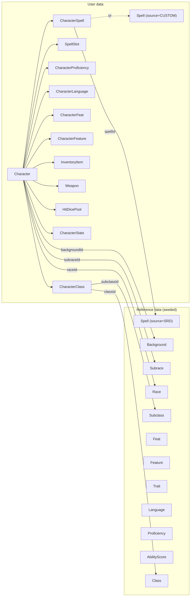

# Data Model

Source of truth: [`@/home/ted/projects/5e-companion/server/prisma/schema.prisma:1-499`](../server/prisma/schema.prisma).

## Two halves of the schema

The schema has a clear split:

1. **SRD / reference data** — seeded from `srd-json-files/`, broadly read-only at runtime. Each row carries an optional `srdIndex` (the stable SRD identifier, e.g. `"wizard"`, `"acolyte"`, `"fireball"`). Rows also keep the original JSON on `raw` for forward-compat.
2. **Character data** — owned by a user (`ownerUserId`), written by the app via GraphQL mutations.

## Spell model (unified SRD + custom)

See [`@/home/ted/projects/5e-companion/server/prisma/schema.prisma:37-70`](../server/prisma/schema.prisma).

- Single `Spell` table.
- `source: SpellSource` discriminates between `SRD` and `CUSTOM`.
- `srdIndex` is `@unique` (so re-running the seed is idempotent for SRD rows) and null for custom spells.
- `classIndexes` and `subclassIndexes` are `String[]` with GIN indexes so class/subclass filters stay fast.
- `raw: Json?` preserves the original SRD object for fields we don't model explicitly yet.
- `damageAtSlotLevel: Json?` is deliberately JSON — the shape is flexible per-spell and not worth fully normalising.

When adding a new filter or display field, prefer promoting a field out of `raw` into a typed column + index rather than reading JSON at query time.

## Character model

- `Character` holds identity and scalar combat stats (AC, speed, initiative) plus spellcasting scalars (`spellSaveDC`, `spellAttackBonus`). Scalars that are **derived** from rules live on relations or in resolvers — see below.
- `CharacterStats` (1:1) holds more complex blocks as JSON (`abilityScores`, `hp`, `deathSaves`, `skillProficiencies`, `traits`, `currency`). These are updated independently by focused mutations (`updateDeathSaves`, `updateSkillProficiencies`, …).
- `CharacterClass` is the multiclass join — `@@unique([characterId, classId])` enforces one row per class. `isStartingClass` marks the class used for starting proficiencies and saving throws.
- `HitDicePool` is one per class. Kept as its own table so short rests can spend dice in specific pools.
- `CharacterSpell` is the spellbook entry (known/prepared). `@@map("CharacterPreparedSpell")` — the table was renamed; don't be surprised by the mismatch.
- `SpellSlot` is one row per (character, kind, level). `kind` is `STANDARD` or `PACT_MAGIC`; level 1–9.

### What's derived vs stored

Several `Character` fields in GraphQL are **computed in resolvers**, not stored:

- `level` — sum of `CharacterClass.level`
- `proficiencyBonus` — from level
- `spellcastingProfiles` — derived per spellcasting class
- `classes`, `spellbook`, `spellSlots`, `stats.hitDicePools`, etc. — shaped in `server/resolvers/character/fieldResolvers.ts` from the Prisma relations

See [`@/home/ted/projects/5e-companion/server/resolvers/character/fieldResolvers.ts`](../server/resolvers/character/fieldResolvers.ts) and [`@/home/ted/projects/5e-companion/server/resolvers/character/multiclassRules.ts`](../server/resolvers/character/multiclassRules.ts).

## Reference data (SRD) models

The reference tables are normalised rather than JSON — `AGENTS.md` is explicit that Prisma is the source of truth for SRD data. Notable relations:

- `Race` → many-to-many to `Trait` and `Language`, plus `AbilityBonus` (join row with bonus) and `Subrace`.
- `Class` → many-to-many to `Proficiency`, has many `Subclass` and `Feature`.
- `Subclass` → belongs to a `Class`, carries `description: String[]`.
- `Background` → many-to-many to `Proficiency` and `Language`, plus the background `Feature`.
- `Feature` is polymorphic — optional FKs to any of `classId`, `subclassId`, `raceId`, `subraceId`, `backgroundId`, `traitId`, `featId`. `FeatureKind` enum tags the owner. When adding feature data, set exactly one of these plus `kind`.
- `Proficiency.type: ProficiencyType` (ARMOR / WEAPON / TOOL / SKILL / SAVING_THROW / OTHER) — filter on this when rendering starting proficiencies.

All reference tables support user-owned rows via `ownerUserId` (null for SRD). Custom subclasses created during character creation end up here.

## Seeding

Run from repo root: `bun db:seed` (or `bunx prisma db seed` from `server/`).

Order in [`@/home/ted/projects/5e-companion/server/prisma/seed.ts:1-14`](../server/prisma/seed.ts):

1. `seedSpells` — SRD spells
2. `seedCustomSpells` — a curated set of custom spells used for dev
3. `seedAbilityScores`
4. `seedRaces`
5. `seedCharacterReferenceData` — classes, subclasses, backgrounds, feats, features, traits, languages, proficiencies
6. `seedCharacter` — a dev character so the app has something to load locally

Seeders are idempotent — keyed on `srdIndex`. If SRD data is missing for a feature you're building, **extend the seed** rather than hard-coding in app code (see `AGENTS.md`).

## Migrations

- Migrations in `server/prisma/migrations/` — naming is `YYYYMMDDHHMMSS_short_description`.
- Run `bun db:migrate -- <name>` from the repo root (this wraps `prisma migrate dev`). Requires Postgres running locally.
- `server/prisma.config.ts` reads `DATABASE_URL` from `.env` at parse time, so **every** Prisma invocation needs it set — even `prisma generate` in CI (see the Unit Tests workflow).
- If the DB is down and you can't use `migrate dev`, write the migration SQL by hand in a new folder under `migrations/` and validate once the DB is available. Do not retry DB-connected Prisma commands from inside sandboxed envs.

## Changes that need coordinated updates

If you change the Prisma schema:

1. Generate a migration: `bun db:migrate -- <name>`.
2. Run `bun db:generate` (usually done automatically by `migrate dev`).
3. Update the GraphQL schema in `server/schema.graphql` if shape exposure changed.
4. Regenerate both codegens: `bun server:codegen && bun app:codegen`.
5. Update seeders if you added a new reference table.
6. Update this doc.
