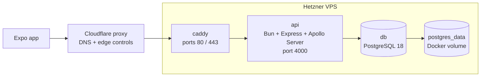

# Deployment

The live API is deployed to a single Hetzner VPS using Docker Compose. This is intentionally a small, single-box production setup: the API, PostgreSQL, and reverse proxy run on the same host, with Caddy as the only public entry point.

## Production shape



Key files:

- [`deploy/docker-compose.prod.yml`](../deploy/docker-compose.prod.yml) — production Compose stack.
- [`deploy/Caddyfile`](../deploy/Caddyfile) — public hostname and reverse proxy rule.
- [`deploy/.env.prod.example`](../deploy/.env.prod.example) — required production environment variables.
- [`server/Dockerfile`](../server/Dockerfile) — Bun image used by the API container.
- [`server/package.json`](../server/package.json) — runtime, migration, seed, and Prisma scripts.

## Compose services

`deploy/docker-compose.prod.yml` defines three services on a private `backend` Docker network:

| Service | Image / build | Public? | Role |
| --- | --- | --- | --- |
| `db` | `postgres:18` | No | Stores Prisma-managed app data and seeded SRD content. |
| `api` | CI-pushed GHCR image for automatic deploys; `server/Dockerfile` build fallback for manual updates | No | Runs `bun run start`, validates env, serves Express + Apollo GraphQL on port `4000`. |
| `caddy` | `caddy:2` | Yes, ports `80` and `443` | Terminates HTTPS and reverse-proxies requests to `api:4000`. |

Only Caddy publishes host ports. The API and database are reachable by service name inside Docker (`api`, `db`) but are not exposed directly to the internet.

## Request path

The production mobile app should set:

```ini
EXPO_PUBLIC_API_URL=https://api.5e-companion.com/
```

The trailing slash matters only for consistency with local config. GraphQL is served at the HTTP root path by the Express API. Do not point the mobile app at `/graphql` unless the server bootstrap is changed deliberately.

Production requests flow like this:

1. The Expo app sends GraphQL requests to `https://api.5e-companion.com/`.
2. Cloudflare proxies the `api.5e-companion.com` DNS record and applies any edge controls before forwarding to the origin.
3. The VPS firewall allows inbound `80` and `443` only from Cloudflare source IP ranges, so direct-origin requests to the VPS IP should not reach Caddy.
4. Caddy receives the HTTPS request, manages TLS certificates automatically, and proxies to `api:4000`.
5. The Bun API verifies Supabase JWTs using `SUPABASE_URL`, then resolves GraphQL operations through Prisma.
6. Prisma connects to Postgres using the Compose-injected `DATABASE_URL`.

## GraphQL production hardening

The API serves GraphQL at the HTTP root path. In production, `NODE_ENV=production` disables schema introspection and the Apollo landing page so anonymous users cannot browse the schema through Apollo's developer tooling. Local development keeps introspection enabled for GraphQL codegen and debugging.

The API also applies an in-memory rate limit to GraphQL execution requests before JSON parsing or Apollo execution. This covers normal `POST` requests and GraphQL `GET` queries while letting CORS preflight through. It is the free-tier fallback when Cloudflare rate limiting is unavailable. It is process-local, so it protects this single-VPS deployment but would need shared storage, such as Redis, if the API is horizontally scaled.

The production defaults allow `120` GraphQL requests per client address per `60000` ms window. Tune them in `deploy/.env.prod` with:

```ini
GRAPHQL_RATE_LIMIT_MAX_REQUESTS=120
GRAPHQL_RATE_LIMIT_WINDOW_MS=60000
```

The limiter uses Express's client IP detection, and the API trusts one reverse-proxy hop so Caddy's forwarded headers identify the client. Cloudflare edge controls reduce traffic before it reaches the VPS, while the API-side limiter remains a fallback inside the origin.

Cloudflare WAF or rate limiting can still be added later to stop abusive traffic before it reaches the VPS. Start with a conservative rule in log or simulate mode, then enforce once normal mobile traffic is understood.

After deployment, verify the behaviour with:

```bash
curl -sS https://api.5e-companion.com/ \
  -H 'content-type: application/json' \
  --data '{"query":"query { __schema { queryType { fields { name } } } }"}'
```

Production should reject that introspection query. Authenticated app queries should continue to work, and repeated GraphQL requests over the configured API limit should return `429 Too Many Requests`.

## Origin protection

Cloudflare can only enforce WAF and edge rate-limit rules for traffic that passes through Cloudflare. The production origin is protected by a VPS firewall allowlist:

- allow inbound `80` and `443` from Cloudflare IPv4 and IPv6 ranges only;
- allow inbound `22` only from trusted administrator IPs where practical;
- do not expose `4000` or `5432` on the host;
- keep the `api.5e-companion.com` DNS record proxied in Cloudflare, not DNS-only.

After firewall changes, verify both paths from outside the VPS:

```bash
curl -i --max-time 10 "https://api.5e-companion.com/" \
  -H 'content-type: application/json' \
  --data '{"query":"query { __typename }"}'

curl -i --max-time 10 --resolve "api.5e-companion.com:443:<VPS_IP>" "https://api.5e-companion.com/" \
  -H 'content-type: application/json' \
  --data '{"query":"query { __typename }"}'
```

The normal hostname request should succeed with Cloudflare response headers such as `cf-ray`. The direct-origin request should time out or be refused. If the direct-origin request returns a GraphQL response, traffic can bypass Cloudflare and any edge WAF or rate-limit rules.

## Environment

Copy [`deploy/.env.prod.example`](../deploy/.env.prod.example) to `deploy/.env.prod` on the server and fill in production values:

| Var | Used by | Purpose |
| --- | --- | --- |
| `API_DOMAIN` | Caddy | Public hostname, currently `api.5e-companion.com`. |
| `POSTGRES_DB` | Postgres + API | Database name. |
| `POSTGRES_USER` | Postgres + API | Database user. |
| `POSTGRES_PASSWORD` | Postgres + API | Database password. |
| `SUPABASE_URL` | API | Supabase project URL used to fetch JWKS for JWT verification. |
| `CORS_ALLOWED_ORIGINS` | API | Comma-separated browser origins allowed to call the GraphQL API. Native clients usually send no `Origin` header. |
| `GRAPHQL_RATE_LIMIT_MAX_REQUESTS` | API | Maximum GraphQL execution requests per client address in each rate-limit window. |
| `GRAPHQL_RATE_LIMIT_WINDOW_MS` | API | GraphQL rate-limit window length in milliseconds. |

The API container receives:

```ini
PORT=4000
NODE_ENV=production
DATABASE_URL=postgresql://${POSTGRES_USER}:${POSTGRES_PASSWORD}@db:5432/${POSTGRES_DB}
SUPABASE_URL=${SUPABASE_URL}
CORS_ALLOWED_ORIGINS=${CORS_ALLOWED_ORIGINS}
GRAPHQL_RATE_LIMIT_MAX_REQUESTS=${GRAPHQL_RATE_LIMIT_MAX_REQUESTS:-120}
GRAPHQL_RATE_LIMIT_WINDOW_MS=${GRAPHQL_RATE_LIMIT_WINDOW_MS:-60000}
```

`DATABASE_URL` deliberately points at the Compose service name `db`, not `localhost`. Inside a container, `localhost` would refer to that same container rather than the Postgres service.

## API image

[`server/Dockerfile`](../server/Dockerfile) builds from `oven/bun:1`, installs server dependencies with the frozen lockfile, runs `bun run prisma:generate`, copies the server source, exposes port `4000`, and starts with:

```bash
bun run start
```

The container does not run migrations automatically on startup. Migrations are a separate deploy step so schema changes are explicit and visible.

## First deploy

On the VPS, from the repo root, with `deploy/.env.prod` present:

```bash
docker compose -f deploy/docker-compose.prod.yml --env-file deploy/.env.prod up -d db
docker compose -f deploy/docker-compose.prod.yml --env-file deploy/.env.prod run --rm api bun run db:deploy
docker compose -f deploy/docker-compose.prod.yml --env-file deploy/.env.prod run --rm api bun run db:seed
docker compose -f deploy/docker-compose.prod.yml --env-file deploy/.env.prod up -d
```

This sequence starts Postgres first, applies Prisma migrations, seeds SRD/reference data, then brings up the full API and Caddy stack.

## Updating the API

### Automatic deploy (push to `main`)

[`.github/workflows/deploy-backend.yml`](../.github/workflows/deploy-backend.yml) runs on pushes to `main` that change backend deploy paths (`server/**`, `deploy/**`, GitHub workflow files, or deploy helper scripts). It calls the same reusable **Unit tests**, **Lint**, and **E2E tests** workflows used by normal CI, then deploys only if all three pass.

After CI passes, the workflow builds `server/Dockerfile`, pushes an immutable API image to GitHub Container Registry as `ghcr.io/<owner>/<repo>-api:<commit-sha>`, then SSHs to the VPS. The VPS deploy script resets the server clone to the exact pushed commit, skips the deploy if that commit is no longer `origin/main`, pulls the exact image built by CI, runs Prisma migrations, brings the Docker Compose stack up, waits for the API container health check, and optionally verifies the public API URL when `PRODUCTION_API_URL` is configured as a GitHub environment or repository variable. The normal **Lint** workflow also runs `actionlint` over `.github/workflows/*.yml`.

Required GitHub Actions secrets:

| Secret | Purpose |
| --- | --- |
| `DEPLOY_HOST` | VPS IP or hostname |
| `DEPLOY_USER` | SSH user on the VPS (for example `deploy`) |
| `DEPLOY_SSH_KEY` | Private SSH key for that user |
| `DEPLOY_KNOWN_HOSTS` | Pinned SSH host key entry for the VPS |
| `DEPLOY_PATH` | Absolute path to the repo clone on the VPS (for example `/opt/5e-companion`) |
| `GHCR_READ_USERNAME` | GitHub username or bot account that can read the API image package |
| `GHCR_READ_TOKEN` | Token for `GHCR_READ_USERNAME` with package read access |

Generate `DEPLOY_KNOWN_HOSTS` from a trusted machine after verifying the VPS host key:

```bash
ssh-keyscan -H <vps-host-or-ip>
```

Create a **`production`** environment in GitHub (**Settings → Environments**) and store the deploy secrets there rather than as repository-wide secrets. Configure the environment to allow deployments from `main` only; add required reviewers and disable administrator bypass if production deploys should always require review. Add `PRODUCTION_API_URL` as an environment or repository variable if you want the deployment record to link to the live API and the workflow to run a public GraphQL smoke test after the container is healthy.

Manual deploy from the Actions tab: run **Deploy backend** via **workflow_dispatch**. This deploys the latest `main` commit and skips only the path filter; the reusable CI workflows still run before the image is built and deployed.

On the VPS, use a dedicated deploy user with key-only SSH access and no password login. The user needs Docker access and a git clone with `deploy/.env.prod` present. Treat Docker access as root-equivalent on a normal Docker Engine host; prefer rootless Docker or narrowly scoped service commands if you harden this later.

### Manual update

For ad-hoc updates or debugging on the VPS:

```bash
docker compose -f deploy/docker-compose.prod.yml --env-file deploy/.env.prod build api
docker compose -f deploy/docker-compose.prod.yml --env-file deploy/.env.prod run --rm api bun run db:deploy
docker compose -f deploy/docker-compose.prod.yml --env-file deploy/.env.prod up -d
```

Automatic deploys do not build on the VPS. They set `API_IMAGE` for Docker Compose and run `pull`, `run --no-build`, and `up --no-build` so production uses the exact image built by GitHub Actions.

Run `db:seed` only when seed data has changed or the database has been reset. The seed scripts are the source of SRD/reference data in production; do not hard-code missing reference data in the mobile app.

## Operations

Useful commands on the VPS:

```bash
docker compose -f deploy/docker-compose.prod.yml --env-file deploy/.env.prod ps
docker compose -f deploy/docker-compose.prod.yml --env-file deploy/.env.prod logs -f api
docker compose -f deploy/docker-compose.prod.yml --env-file deploy/.env.prod logs -f caddy
docker compose -f deploy/docker-compose.prod.yml --env-file deploy/.env.prod exec db sh -lc 'psql -U "$POSTGRES_USER" -d "$POSTGRES_DB"'
```

Caddy stores certificate state in the `caddy_data` volume and config state in `caddy_config`. Postgres stores data in the `postgres_data` volume. Backups should target the Postgres database or the `postgres_data` volume before destructive maintenance.

## VPS assumptions

The stack assumes the host has:

- Docker Engine and the Docker Compose plugin.
- DNS `A` record for `api.5e-companion.com` pointing at the VPS IPv4 address.
- Firewall access for `22`, `80`, and `443`; the app database and API port stay private to Docker.

The deployment is easy to split later: move Postgres to managed hosting, update `DATABASE_URL`, and remove or ignore the Compose `db` service.
