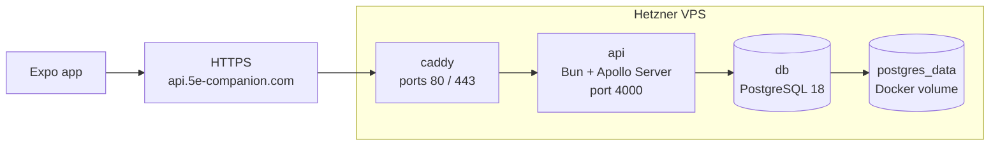

# Deployment

The live API is deployed to a single Hetzner VPS using Docker Compose. This is intentionally a small, single-box production setup: the API, PostgreSQL, and reverse proxy run on the same host, with Caddy as the only public entry point.

## Production shape



Key files:

- [`deploy/docker-compose.prod.yml`](../deploy/docker-compose.prod.yml) — production Compose stack.
- [`deploy/Caddyfile`](../deploy/Caddyfile) — public hostname and reverse proxy rule.
- [`deploy/.env.prod.example`](../deploy/.env.prod.example) — required production environment variables.
- [`server/Dockerfile`](../server/Dockerfile) — Bun image used by the API container.
- [`server/package.json`](../server/package.json) — runtime, migration, seed, and Prisma scripts.

## Compose services

`deploy/docker-compose.prod.yml` defines three services on a private `backend` Docker network:

| Service | Image / build | Public? | Role |
| --- | --- | --- | --- |
| `db` | `postgres:18` | No | Stores Prisma-managed app data and seeded SRD content. |
| `api` | Built from `server/Dockerfile` | No | Runs `bun run start`, validates env, serves Apollo GraphQL on port `4000`. |
| `caddy` | `caddy:2` | Yes, ports `80` and `443` | Terminates HTTPS and reverse-proxies requests to `api:4000`. |

Only Caddy publishes host ports. The API and database are reachable by service name inside Docker (`api`, `db`) but are not exposed directly to the internet.

## Request path

The production mobile app should set:

```ini
EXPO_PUBLIC_API_URL=https://api.5e-companion.com/
```

The trailing slash matters only for consistency with local config. The current server uses Apollo's `startStandaloneServer(...)`, so GraphQL is served at the HTTP root path. Do not point the mobile app at `/graphql` unless the server bootstrap is changed deliberately.

Production requests flow like this:

1. The Expo app sends GraphQL requests to `https://api.5e-companion.com/`.
2. DNS points `api.5e-companion.com` at the Hetzner VPS.
3. Caddy receives the HTTPS request, manages TLS certificates automatically, and proxies to `api:4000`.
4. The Bun API verifies Supabase JWTs using `SUPABASE_URL`, then resolves GraphQL operations through Prisma.
5. Prisma connects to Postgres using the Compose-injected `DATABASE_URL`.

## Environment

Copy [`deploy/.env.prod.example`](../deploy/.env.prod.example) to `deploy/.env.prod` on the server and fill in production values:

| Var | Used by | Purpose |
| --- | --- | --- |
| `API_DOMAIN` | Caddy | Public hostname, currently `api.5e-companion.com`. |
| `POSTGRES_DB` | Postgres + API | Database name. |
| `POSTGRES_USER` | Postgres + API | Database user. |
| `POSTGRES_PASSWORD` | Postgres + API | Database password. |
| `SUPABASE_URL` | API | Supabase project URL used to fetch JWKS for JWT verification. |

The API container receives:

```ini
PORT=4000
DATABASE_URL=postgresql://${POSTGRES_USER}:${POSTGRES_PASSWORD}@db:5432/${POSTGRES_DB}
SUPABASE_URL=${SUPABASE_URL}
```

`DATABASE_URL` deliberately points at the Compose service name `db`, not `localhost`. Inside a container, `localhost` would refer to that same container rather than the Postgres service.

## API image

[`server/Dockerfile`](../server/Dockerfile) builds from `oven/bun:1`, installs server dependencies with the frozen lockfile, runs `bun run prisma:generate`, copies the server source, exposes port `4000`, and starts with:

```bash
bun run start
```

The container does not run migrations automatically on startup. Migrations are a separate deploy step so schema changes are explicit and visible.

## First deploy

On the VPS, from the repo root, with `deploy/.env.prod` present:

```bash
docker compose -f deploy/docker-compose.prod.yml --env-file deploy/.env.prod up -d db
docker compose -f deploy/docker-compose.prod.yml --env-file deploy/.env.prod run --rm api bun run db:deploy
docker compose -f deploy/docker-compose.prod.yml --env-file deploy/.env.prod run --rm api bun run db:seed
docker compose -f deploy/docker-compose.prod.yml --env-file deploy/.env.prod up -d
```

This sequence starts Postgres first, applies Prisma migrations, seeds SRD/reference data, then brings up the full API and Caddy stack.

## Updating the API

For normal backend updates:

```bash
docker compose -f deploy/docker-compose.prod.yml --env-file deploy/.env.prod build api
docker compose -f deploy/docker-compose.prod.yml --env-file deploy/.env.prod run --rm api bun run db:deploy
docker compose -f deploy/docker-compose.prod.yml --env-file deploy/.env.prod up -d
```

Run `db:seed` only when seed data has changed or the database has been reset. The seed scripts are the source of SRD/reference data in production; do not hard-code missing reference data in the mobile app.

## Operations

Useful commands on the VPS:

```bash
docker compose -f deploy/docker-compose.prod.yml --env-file deploy/.env.prod ps
docker compose -f deploy/docker-compose.prod.yml --env-file deploy/.env.prod logs -f api
docker compose -f deploy/docker-compose.prod.yml --env-file deploy/.env.prod logs -f caddy
docker compose -f deploy/docker-compose.prod.yml --env-file deploy/.env.prod exec db sh -lc 'psql -U "$POSTGRES_USER" -d "$POSTGRES_DB"'
```

Caddy stores certificate state in the `caddy_data` volume and config state in `caddy_config`. Postgres stores data in the `postgres_data` volume. Backups should target the Postgres database or the `postgres_data` volume before destructive maintenance.

## VPS assumptions

The stack assumes the host has:

- Docker Engine and the Docker Compose plugin.
- DNS `A` record for `api.5e-companion.com` pointing at the VPS IPv4 address.
- Firewall access for `22`, `80`, and `443`; the app database and API port stay private to Docker.

The deployment is easy to split later: move Postgres to managed hosting, update `DATABASE_URL`, and remove or ignore the Compose `db` service.
