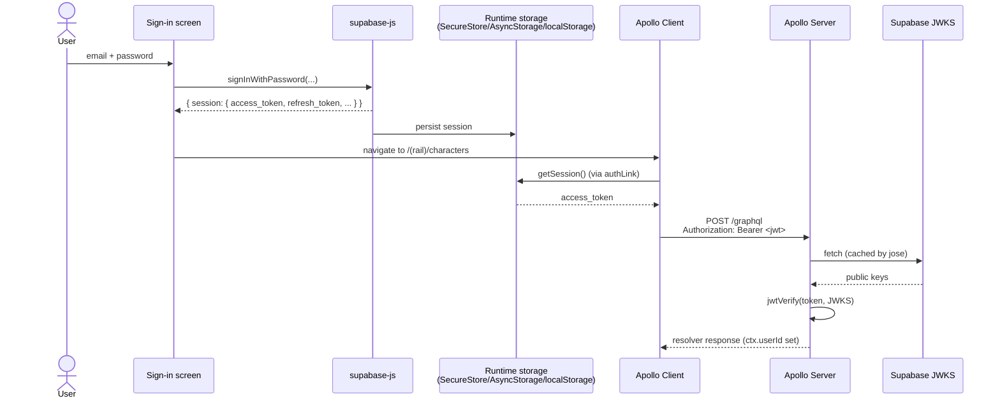

# Feature: Authentication

Supabase Auth provides identity; the GraphQL server trusts JWTs signed by the project's JWKS. There is no bespoke auth code beyond wiring Supabase in on the client and verifying JWTs on the server.

## End-to-end flow



## Components

### Mobile client (`mobile-app/`)

- [`@/home/ted/projects/5e-companion/mobile-app/lib/supabase.ts`](../../mobile-app/lib/supabase.ts) — creates the Supabase client with a runtime-appropriate **storage adapter**:

  | Runtime | Auth-token ("large") storage | Metadata ("small") storage | Notes |
  | --- | --- | --- | --- |
  | Native (iOS/Android) | `AsyncStorage` | `expo-secure-store` | SecureStore has a ~2 KB item limit, which the access token often exceeds, so the adapter routes large blobs (`*auth-token*`) to AsyncStorage and everything else to SecureStore. |
  | Web (browser) | `window.localStorage` | `window.localStorage` | Via a thin `canUseWebStorage()` guard. |
  | Web (SSR / Jest) | No-op adapter | No-op adapter | `persistSession` + `autoRefreshToken` are disabled when storage isn't available. |

  Env vars:
  ```ini
  EXPO_PUBLIC_SUPABASE_URL=...
  EXPO_PUBLIC_SUPABASE_PUBLISHABLE_KEY=...
  ```

- [`@/home/ted/projects/5e-companion/mobile-app/app/apolloClient.ts:8-18`](../../mobile-app/app/apolloClient.ts) — `SetContextLink` reads the current session from Supabase and adds `Authorization: Bearer <access_token>` to every request. If there's no session, no header is attached (so requests from `(auth)` screens don't carry a bogus token).

- [`@/home/ted/projects/5e-companion/mobile-app/hooks/useSessionGuard.ts`](../../mobile-app/hooks/useSessionGuard.ts) — used by protected screens to (a) check for a session on mount and (b) allow manual re-checks (e.g. after sign-in). When there's no session it `router.replace('/(auth)/sign-in')` by default.

- `mobile-app/app/(auth)/sign-in.tsx` and `sign-up.tsx` — Supabase email/password flows. They don't call `useSessionGuard` themselves; instead they call `supabase.auth.signIn…` directly and then navigate on success.

### Server (`server/`)

- [`@/home/ted/projects/5e-companion/server/lib/auth.ts:1-21`](../../server/lib/auth.ts):

  ```ts
  const jwks = createRemoteJWKSet(new URL(`${SUPABASE_ISSUER}/.well-known/jwks.json`));
  ```

  `jose` caches JWKS fetches, so the per-request overhead is negligible after warm-up.

- `getUserIdFromAuthHeader(header)` — returns the `sub` claim when the token verifies against the Supabase issuer, else `null`.

- `requireUser(ctx)` — throws `'UNAUTHENTICATED'` when `ctx.userId` is null. Call this at the top of any resolver that needs a user.

- [`@/home/ted/projects/5e-companion/server/index.ts:20-28`](../../server/index.ts) — the context factory catches any verification error, logs it, and falls through with `{ userId: null }`, letting resolvers decide. Today every query/mutation requires a user.

Env var:
```ini
SUPABASE_URL=https://<project>.supabase.co
```

Only the URL is needed — the server verifies signatures against Supabase's public JWKS and never sees Supabase secrets.

## Ownership rules

- Every user-owned row has `ownerUserId: String` and every query/mutation that touches it filters by `ownerUserId = requireUser(ctx)`.
- `Character` is the primary ownership root; nested rows are deleted via `onDelete: Cascade`.
- SRD reference rows have `ownerUserId: null`; user-owned extras (custom subclasses, custom spells) coexist in the same tables with a non-null `ownerUserId`.

## E2E auth setup

For Playwright, a local Supabase stack is used rather than the production Supabase project:

- `supabase/config.toml` — config for the local stack.
- `bun e2e:up` / `down` / `reset` — `bunx supabase` wrappers.
- `mobile-app/e2e/supabaseLocalStack.ts` — helpers to read URLs, service keys, and seed a test user.
- `mobile-app/e2e/globalSetup.ts` — migrates the local DB and seeds the test user + a test character.
- `mobile-app/e2e/auth.setup.ts` — performs a real UI sign-in once per run and saves storage state to `e2e/.auth/user.json`.
- Downstream specs reuse that storage state via Playwright's `storageState`.

## Things to know

- **JWT format / issuer**: `iss = `${SUPABASE_URL}/auth/v1``. If you swap Supabase projects, both client env and server `SUPABASE_URL` must match; otherwise `jose` will reject tokens with an issuer mismatch.
- **Logout**: call `supabase.auth.signOut()`. The storage adapter handles key cleanup. Apollo does not need an explicit reset — the next request will omit the Bearer header and the server will refuse it.
- **Refresh**: handled by `supabase-js` when `autoRefreshToken` is on. The `SetContextLink` always reads the **current** session, so refreshed tokens are picked up automatically on the next request.
- **No RLS**: we don't rely on Supabase Postgres RLS for authz — the GraphQL server enforces ownership in resolvers against our own Postgres. Supabase is used purely for identity.
- **Web bundle caching**: when you change `EXPO_PUBLIC_SUPABASE_URL`, restart Metro with `--clear`, otherwise the bundle will still point at the old URL (see the `--clear` flag in `mobile-app/playwright.config.ts`).
