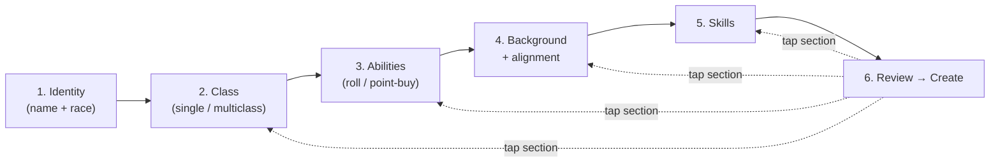

# Feature: Character Creation

Multi-step Expo Router wizard at `mobile-app/app/characters/create/` that collects a draft character and submits it via the `createCharacter` GraphQL mutation.

> **Canonical reference**: [`@/home/ted/projects/5e-companion/mobile-app/app/characters/create/CHARACTER_CREATION_FLOW.md`](../../mobile-app/app/characters/create/CHARACTER_CREATION_FLOW.md) is the detailed, up-to-date spec maintained next to the screens. Read that first. This doc is a short agent-facing map + pointers to the server side.

## Mental model

- State lives in a single `CharacterDraftProvider` React Context (see [`@/home/ted/projects/5e-companion/mobile-app/store/characterDraft.tsx`](../../mobile-app/store/characterDraft.tsx)).
- A shared `WizardShell` renders the header (progress bar + step dots), footer (Continue CTA), and handles back/cancel.
- Step-gating rules live in `mobile-app/lib/characterCreation/stepCompletion.ts`.
- Submission shapes the draft into `CreateCharacterInput` via `mobile-app/lib/characterCreation/buildCreateCharacterInput.ts`.

## Key files

### Client

| File | Role |
| --- | --- |
| `mobile-app/app/characters/create/_layout.tsx` | Wraps the wizard in `CharacterDraftProvider` + `WizardShell` |
| `mobile-app/app/characters/create/{index,class,abilities,background,skills,review}.tsx` | Step screens |
| `mobile-app/store/characterDraft.tsx` | Draft context + all mutator helpers |
| `mobile-app/lib/characterCreation/` | Pure business logic: multiclass, options, class rules, ability rules, race rules, buildCreateCharacterInput, routes, step completion |
| `mobile-app/components/wizard/` | Shared wizard pieces (shell, option grid, alignment grid, class-allocation row, ability modes) |

Go to `CHARACTER_CREATION_FLOW.md` for per-step behaviour, the `CharacterDraft` type, multiclass rules, gotchas, etc.

### Server

| File | Role |
| --- | --- |
| [`@/home/ted/projects/5e-companion/server/resolvers/character/lifecycleMutations.ts`](../../server/resolvers/character/lifecycleMutations.ts) | `createCharacter` mutation |
| [`@/home/ted/projects/5e-companion/server/resolvers/character/multiclassRules.ts`](../../server/resolvers/character/multiclassRules.ts) | Rules: proficiency bonus, hit-dice pools, spell slots, class allocation validation, starting HP |
| [`@/home/ted/projects/5e-companion/server/resolvers/character/subclassReferences.ts`](../../server/resolvers/character/subclassReferences.ts) | Loads visible subclasses (SRD + user-owned), materialises custom subclasses |

The mutation resolves classes/subclasses/race/background by `srdIndex`. The client's option values must stay aligned with seeded SRD data — see the "Character creation reference-data note" in `AGENTS.md`.

## Custom subclasses

The class step allows a "custom subclass" per class row (name + description). On create, `normaliseCustomSubclassInput` + `materialiseResolvedCharacterClasses` in `subclassReferences.ts` create a `Subclass` row with `ownerUserId` set so it only shows up for that user going forward.

## Adding a new step

1. Add the screen `.tsx` under `mobile-app/app/characters/create/`.
2. Add the route to `CREATE_CHARACTER_ROUTES` in `mobile-app/lib/characterCreation/routes.ts` (in order).
3. Add a completion gate to `isCreateCharacterStepComplete` in `stepCompletion.ts` (or `() => true` if always-pass).
4. Update `buildCreateCharacterInput` if the step affects the final mutation input.
5. If you need new server-side validation or storage, update `schema.graphql` + regenerate codegen + extend `createCharacter` and `multiclassRules.ts`.
6. Update `CHARACTER_CREATION_FLOW.md` in the same commit.

## Tests

- Client unit tests for logic helpers: `mobile-app/lib/__tests__/characterCreation*.test.ts` (and related folders).
- Screen tests exist under `mobile-app/app/characters/create/__tests__/` — prefer extending these over adding new test files when you're tweaking an existing step.
- Server tests: `server/resolvers/characterResolvers.lifecycleMutations.test.ts` and `server/resolvers/character/multiclassRules.test.ts`.
