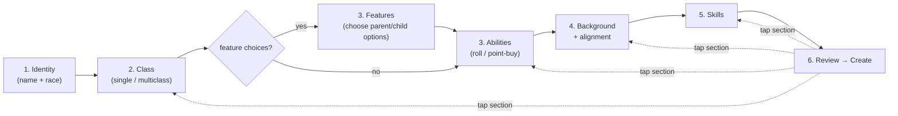

# Feature: Character Creation

Multi-step Expo Router wizard at `mobile-app/app/characters/create/` that collects a draft character and submits it via the `createCharacter` GraphQL mutation.

> **Canonical reference**: [`@/home/ted/projects/5e-companion/mobile-app/app/characters/create/CHARACTER_CREATION_FLOW.md`](../../mobile-app/app/characters/create/CHARACTER_CREATION_FLOW.md) is the detailed, up-to-date spec maintained next to the screens. Read that first. This doc is a short agent-facing map + pointers to the server side.

## Mental model

```mermaid
flowchart LR
    idx["1. Identity<br/>(name + race)"] --> cls["2. Class<br/>(single / multiclass)"]
    cls --> fc{"feature choices?"}
    fc -->|yes| feat["3. Features<br/>(choose parent/child options)"]
    fc -->|no| ab["3. Abilities<br/>(roll / point-buy)"]
    feat --> ab
    ab --> bg["4. Background<br/>+ alignment"]
    bg --> sk["5. Skills"]
    sk --> rv["6. Review → Create"]
    rv -.->|tap section| cls
    rv -.->|tap section| ab
    rv -.->|tap section| bg
    rv -.->|tap section| sk
```

- State lives in a single `CharacterDraftProvider` React Context (see [`@/home/ted/projects/5e-companion/mobile-app/store/characterDraft.tsx`](../../mobile-app/store/characterDraft.tsx)).
- A shared `WizardShell` renders the header (progress bar + step dots), footer (Continue CTA), and handles back/cancel.
- Step-gating rules live in `mobile-app/lib/characterCreation/stepCompletion.ts`.
- Submission shapes the draft into `CreateCharacterInput` via `mobile-app/lib/characterCreation/buildCreateCharacterInput.ts`.
- When the selected class rows unlock SRD parent/child feature choices (for example Pact Boon or Fighting Style), the wizard inserts a conditional `features` step before abilities and sends `featureChoices` to `createCharacter`.

## Key files

### Client

| File | Role |
| --- | --- |
| `mobile-app/app/characters/create/_layout.tsx` | Wraps the wizard in `CharacterDraftProvider` + `WizardShell` |
| `mobile-app/app/characters/create/{index,class,features,abilities,background,skills,review}.tsx` | Step screens |
| `mobile-app/app/characters/create/race.tsx` | Redirects to the identity step; kept so direct navigation to the old route does not break |
| `mobile-app/store/characterDraft.tsx` | Draft context + all mutator helpers |
| `mobile-app/lib/characterCreation/` | Pure business logic: multiclass, options, class rules, ability rules, race rules, buildCreateCharacterInput, routes, step completion |
| `mobile-app/components/wizard/` | Shared wizard pieces (shell, option grid, alignment grid, class-allocation row, ability modes) |

Go to `CHARACTER_CREATION_FLOW.md` for per-step behaviour, the `CharacterDraft` type, multiclass rules, gotchas, etc.

### Server

| File | Role |
| --- | --- |
| [`@/home/ted/projects/5e-companion/server/resolvers/character/lifecycleMutations.ts`](../../server/resolvers/character/lifecycleMutations.ts) | `createCharacter` mutation |
| [`@/home/ted/projects/5e-companion/server/resolvers/character/multiclassRules.ts`](../../server/resolvers/character/multiclassRules.ts) | Rules: proficiency bonus, hit-dice pools, spell slots, class allocation validation, starting HP |
| [`@/home/ted/projects/5e-companion/server/resolvers/character/subclassReferences.ts`](../../server/resolvers/character/subclassReferences.ts) | Loads visible subclasses (SRD + user-owned), materialises custom subclasses |

The mutation resolves SRD classes by `srdIndex` and current-user custom classes by their database ID. Race and background values remain SRD-backed. The class picker loads `availableClasses`, including each class definition's tile emoji, so active custom classes authored in the Compendium are selectable and visually distinct without adding client constants.

## Custom subclasses

The class step loads every visible subclass for each selected parent class. Each option displays its database-backed `selectionLevel`; options above the allocated class level stay visible but disabled. Subclass choice is optional at every level, and reducing an allocation below a selected subclass's level clears that selection. The create flow does not create custom subclasses inline: reusable custom rows are created in `/compendium/subclasses`, then appear here. Manager-created custom subclasses can include reusable feature definitions, which are saved as user-owned `Feature` rows and shown anywhere available subclass details are loaded.

Custom subclasses can also be archived by the subclass manager. Archived custom subclasses are hidden from future creation and level-up subclass pickers, and the create mutation rejects archived custom subclass ids even if the caller submits one directly. Existing characters keep their archived subclass relation for display; `saveCharacterSheet` may preserve an archived subclass id only when that subclass is already attached to the same character.

Custom classes follow the same preservation rule. Starting HP, hit dice, saving throws, fixed class proficiencies, configured starting skill choice groups, spell slots, spellcasting profiles, and class features are derived from the resolved class definition. Each starting skill choice group is presented and limited independently. Custom standard-caster slot tables also determine their effective multiclass caster contribution. Pact slots at the same level are combined into one persisted pool. Starting-equipment definitions are displayed and authorable but are not copied to inventory automatically.

### Skill and proficiency choices (starting + multiclass)

Fixed skill grants (`choiceGroup == null`) for the starting class (`STARTING`) and every secondary class (`MULTICLASS`) are shown as locked selections on the skills step, alongside locked background skills — the same "auto-selected, not choosable away" treatment. Fixed grants and background skills are never stored as draft choice picks; `createCharacter` derives them via `deriveCreationSkillRequirements` / `deriveBackgroundSkillKeys` and merges them into persisted `skillProficiencies`.

All pick-N proficiency groups — **SKILL and named** (armor / weapon / tool / other) — share one class-scoped model. Selections live in `draft.proficiencyChoices` keyed by `(classId, choiceGroup)` with option values `srdIndex ?? id` (e.g. `skill-athletics`, `lute`, custom proficiency ids). The same shape is submitted as `CreateCharacterInput.proficiencyChoices`. The server validates every group independently with `deriveCreationProficiencyChoiceRequirements` / `validateCreationProficiencyChoices`, then derives persisted skills from validated SKILL picks plus fixed/background grants (`skillKeysFromValidatedChoices` / `derivePersistedCreationSkillProficiencies`). `CreateCharacterInput.skillProficiencies` is a compatibility field only — not choice provenance. Nested SRD choice pools are flattened at seed time so one group includes every leaf option.

Changing the class set or starting-class designation clears proficiency draft picks. When async class definitions finish loading, `WizardShell` reconciles draft picks against the current option groups so invalid hidden selections cannot survive. Step completion checks option membership and exact unique counts, and blocks while requirements are loading or failed.

`useCreationProficiencyRequirements` (shared by the skills step, review display, and `WizardShell`) loads every selected class definition via `attachedClassDetails`. GraphQL failures and settled but incomplete batches (any selected class missing from the response) both surface as a requirements error with the skills-step retry UI; "Continue" stays disabled until every selected class resolves and every required group is filled. Soft SRD skill-table fallback applies only when a resolved starting-class definition has no STARTING SKILL choice rules — never when a selected class is absent from the batch. The review step shows chosen skill labels (from class-scoped picks + fixed/background) and selected named proficiency labels.

## Adding a new step

1. Add the screen `.tsx` under `mobile-app/app/characters/create/`.
2. Add the route to `CREATE_CHARACTER_ROUTES` in `mobile-app/lib/characterCreation/routes.ts` (in order).
3. Add a completion gate to `isCreateCharacterStepComplete` in `stepCompletion.ts` (or `() => true` if always-pass).
4. Update `buildCreateCharacterInput` if the step affects the final mutation input.
5. If you need new server-side validation or storage, update `schema.graphql` + regenerate codegen + extend `createCharacter` and `multiclassRules.ts`.
6. Update `CHARACTER_CREATION_FLOW.md` in the same commit.

## Tests

- Client unit tests for logic helpers: `mobile-app/lib/__tests__/characterCreation*.test.ts` (and related folders).
- Screen tests exist under `mobile-app/app/characters/create/__tests__/` — prefer extending these over adding new test files when you're tweaking an existing step.
- Server tests: `server/resolvers/characterResolvers.lifecycleMutations.test.ts` and `server/resolvers/character/multiclassRules.test.ts`.
