# Feature: Level-up Wizard

A dynamic, per-character wizard that walks the user through levelling up one class by one level. Unlike the create flow, the step list is **assembled per class/level** so you only see the steps you need (ASI, subclass, spellcasting, invocations, …).

## Where it lives

- **Orchestration hook** (single source of truth): [`@/home/ted/projects/5e-companion/mobile-app/hooks/useLevelUpWizard.ts`](../../mobile-app/hooks/useLevelUpWizard.ts) — ~600 lines that own every piece of wizard state and expose action callbacks.
- **Shell + step UI**: `mobile-app/components/character-sheet/level-up/` — e.g. `LevelUpWizardSheet.tsx`, `LevelUpWizardStepBody.tsx`, plus one `LevelUp<StepName>Step.tsx` per step.
- **Pure logic** (no React): `mobile-app/lib/characterLevelUp/` — one module per concern.
- **SRD data**: [`@/home/ted/projects/5e-companion/mobile-app/lib/characterLevelUp/levelUpSrdData.generated.ts`](../../mobile-app/lib/characterLevelUp/levelUpSrdData.generated.ts) — generated lookup tables for features, class resources, spell slots, invocations, metamagic, mystic arcanum, etc.

## Step assembly

`buildLevelUpStepList()` in [`@/home/ted/projects/5e-companion/mobile-app/lib/characterLevelUp/stepAssembly.ts:193-238`](../../mobile-app/lib/characterLevelUp/stepAssembly.ts) computes the step list:

```mermaid
flowchart LR
    start(["choose_class"]) --> hp(["hit_points"])
    hp -->|ASI level?| asi(["asi_or_feat"])
    asi --> subPick
    hp --> subPick
    subPick{"needs subclass?"}
    subPick -->|yes| sub(["subclass_selection"])
    subPick -->|no| newF
    sub --> newF
    newF{"new features?"}
    newF -->|yes| nf(["new_features"])
    newF -->|no| spell
    nf --> spell
    spell{"spellcasting<br/>changes?"}
    spell -->|yes| sp(["spellcasting_updates"])
    spell -->|no| mc
    sp --> mc
    mc{"new class<br/>(multiclass)?"}
    mc -->|yes| mcp(["multiclass_proficiencies"])
    mc -->|no| cr
    mcp --> cr
    cr{"class resource<br/>changes?"}
    cr -->|yes| res(["class_resources"])
    cr -->|no| sum
    res --> sum(["summary"])
```

Rules by condition:

| Step | Included when |
| --- | --- |
| `choose_class` | Always |
| `hit_points` | Always |
| `asi_or_feat` | `ASI_LEVELS_BY_CLASS_ID[classId].includes(newLevel)` |
| `subclass_selection` | Class has no subclass yet (offered at every level until one is chosen) |
| `new_features` | The class gains at least one feature at this level (SRD + custom), including inline parent/child feature choices like Pact Boon or Hunter's Prey |
| `spellcasting_updates` | New spell slots, spells known/prepared, cantrips, swaps |
| `multiclass_proficiencies` | This is a brand-new class being added |
| `class_resources` | Resource progression changes (Rage uses, Sorcery Points, etc.) or advanced choices (invocations, metamagic, mystic arcanum) |
| `summary` | Always |

## State model

All state is held locally by `useLevelUpWizard` via many `useState` hooks — **no global store**. It splits concerns into sub-state objects, each with a `create…State()` factory in the matching logic module:

| Sub-state | Lives in |
| --- | --- |
| `classSelection` | `chooseClass.ts` |
| `hitPointsState` | `hitPoints.ts` |
| `asiOrFeatState` | `asiOrFeat.ts` |
| `subclassSelectionState` | `subclassFeatures.ts` |
| `spellcastingState` | `spellcasting.ts` |
| `multiclassProficiencyState` | `multiclassProficiencies.ts` |
| `invocationState`, `metamagicState`, `mysticArcanumState` | `advancedClassChoices.ts` |
| `featureChoiceSelections`, `customFeatures` | in-hook, shaped by `subclassFeatures.ts` draft types |

Each module exports:

- A `create…State()` factory.
- Pure transition functions (`toggle…`, `setX…`, `increment…`).
- A `canContinueFrom…()` predicate the hook uses to gate the "Continue" button.

The hook wires callbacks and memoises derived values (`steps`, `selectedClass`, `spellcastingSummary`, `newFeatures`, `featureChoiceGroups`, …). Steps and derived state recompute as the class or other inputs change.

## Applying the draft to the sheet

Once the user reaches the summary step and confirms, the wizard's local state is applied to the character sheet **draft** (not the server) via:

- [`@/home/ted/projects/5e-companion/mobile-app/lib/characterLevelUp/draftApplication.ts`](../../mobile-app/lib/characterLevelUp/draftApplication.ts)

The sheet draft layer lives in:

- [`@/home/ted/projects/5e-companion/mobile-app/hooks/useCharacterSheetDraft.ts`](../../mobile-app/hooks/useCharacterSheetDraft.ts)
- `mobile-app/lib/character-sheet/`

The draft then gets persisted via the `saveCharacterSheet` mutation when the user saves the sheet — the level-up wizard itself does **not** talk to the server.

## Feature-choice handling

The `new_features` step now handles two cases:

- Plain gained features are shown as read-only cards and added directly to the draft.
- Parent/child SRD feature groups (for example `Pact Boon`, `Fighting Style`, `Circle of the Land`, and the Hunter subclass pickers) render the parent feature card plus an inline child picker. The user must choose a child before continuing.

When the level-up is confirmed, the draft keeps the parent feature row and adds only the selected child feature row. Unchosen child options are never appended to the sheet draft.

## Adding a new step

1. Add the step id to `LevelUpWizardStepId` (in `types.ts`) and content to `LEVEL_UP_WIZARD_STEP_CONTENT`.
2. Insert it into the conditional chain in `buildLevelUpStepList()` (pay attention to ordering).
3. Create the logic module under `mobile-app/lib/characterLevelUp/<name>.ts` with `create…State`, transitions, and `canContinueFrom…`.
4. Add a component under `components/character-sheet/level-up/LevelUp<Name>Step.tsx`.
5. Wire it into `LevelUpWizardStepBody.tsx` (the switch on `step.id`).
6. Extend `useLevelUpWizard.ts`: new state slot + reset effects + callbacks + return object.
7. If the draft application changes, update `draftApplication.ts`.
8. Add tests under `mobile-app/lib/__tests__/` for the logic and `components/character-sheet/level-up/__tests__/` for UI.
9. Update this doc.

## Things to know before digging in

- **`useLevelUpWizard.ts` is big on purpose** — centralising all state keeps cross-step invariants visible. Refactor only if a split doesn't fragment the invariants.
- **`levelUpSrdData.generated.ts`** is generated from the SRD. Don't hand-edit; update the generator if you need to change it.
- **Invocation prerequisite context** is recomputed whenever `selectedClass` or character data changes. If you rely on it, read from `invocationPrerequisiteContext` rather than rebuilding.
- **The wizard resets on `visible` transitions** — see the `useEffect` in `useLevelUpWizard.ts` that blanks every sub-state when `visible` flips.
- **Custom subclasses and custom features** are first-class here — the wizard can produce a `customSubclass` or custom features that then round-trip via `draftApplication.ts` → `saveCharacterSheet`. The subclass selection step also includes active custom subclasses and reusable custom subclass feature definitions created in the `/subclasses` manager for the matching parent class.
- **Subclass choice is optional and level-aware** — all matching options are shown using their database-backed selection levels; options above the new class level are disabled and Next remains available with no choice. The inline custom form requires a selection level from 1 through the new class level and defaults it to that new level.
- **Late choices catch up** — selecting a subclass after its earliest level adds all earned subclass features and required subclass feature choices at or below the new class level. Draft application skips duplicate feature name/source pairs.
- **Archived custom subclasses are not future choices** — archived user-owned subclasses are hidden from level-up selection and direct submissions are rejected unless `saveCharacterSheet` is preserving an archived subclass already attached to that same character.
