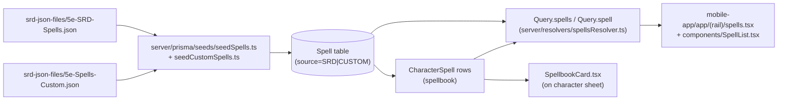

# Feature: Spells

Unified SRD + custom spell pipeline, from JSON on disk all the way to the character's spellbook.

## Lifecycle

## Storage

Single `Spell` table — see [`data-model.md`](../data-model.md) and [`@/home/ted/projects/5e-companion/server/prisma/schema.prisma:37-70`](../../server/prisma/schema.prisma).

- `source: 'SRD' | 'CUSTOM'` discriminator.
- `srdIndex` (unique when set) — stable SRD identifier, null for custom.
- `classIndexes`, `subclassIndexes` (`String[]` with GIN indexes) — who can cast it.
- `raw: Json?` — original JSON for fields not yet promoted to columns.
- `CharacterSpell` join (mapped to `CharacterPreparedSpell` table) holds spellbook entries with a `prepared` flag.

## Server-side querying

Entry: [`@/home/ted/projects/5e-companion/server/resolvers/spellsResolver.ts:32-61`](../../server/resolvers/spellsResolver.ts).

1. **Auth** — `requireUser(ctx)` (the roster is user-scoped because custom spells belong to a user).
2. **Where clause** — `buildWhere(filter)` in [`@/home/ted/projects/5e-companion/server/lib/spellFilters.ts`](../../server/lib/spellFilters.ts). It maps:
   - Exact arrays: `levels`, `classes`, `schools`, `components` → Prisma `in` / `hasSome`.
   - Booleans: `ritual`, `concentration`, `hasMaterial`, `hasHigherLevel`.
   - Categories: `rangeCategories`, `durationCategories`, `castingTimeCategories` — each category maps to a set of raw DB values (see the `RANGE_CATEGORY_VALUES`, `DURATION_CATEGORY_VALUES`, `CASTING_TIME_CATEGORY_VALUES` maps). `self` + `1_reaction` are handled via `startsWith` because the DB has variants like `"Self (60-foot cone)"` and `"1 reaction, when …"`.
3. **Select** — `buildSpellSelect(info)` inspects the GraphQL request's `info` object and projects only the requested fields, so the DB reads the minimum.
4. **Pagination** — `limit` clamped to `MAX_SPELLS_PAGE_SIZE = 200`, `offset` must be a non-negative integer.
5. **Order** — `level asc, name asc, id asc` (stable for paging).

## Adding a new server-side filter

1. Add the field to `input SpellFilter` in [`server/schema.graphql`](../../server/schema.graphql).
2. Run `bun server:codegen`.
3. Extend `buildWhere` in `server/lib/spellFilters.ts`. If it's a new category-style filter, add a category → values map and an `Or` helper like the existing ones.
4. Add a test in `server/lib/spellFilters.test.ts` asserting the `where` clause shape.
5. Expose it in the mobile UI (see below).
6. Run `bun app:codegen`.

## Mobile spell library

- **Screen**: `mobile-app/app/(rail)/spells.tsx` — GraphQL query + filter drawer + list.
- **List**: `mobile-app/components/SpellList.tsx` — a configurable SectionList grouping by level.
- **Filter drawer**: `mobile-app/components/SpellFilterDrawer.tsx` uses `lib/spellFilters.ts` option tables (`CLASS_OPTIONS`, `LEVEL_OPTIONS`, `SCHOOL_OPTIONS`, etc.) and `FilterChipGroup` / `FilterSwitch`.
- **Detail**: `mobile-app/app/spells/[id].tsx` + `components/character-sheet/spells/SpellDetailModal.tsx`.
- **Virtualisation gotcha**: `SectionList` virtualises rows — in tests, apply the filter/search first so assertions hit rendered rows (`AGENTS.md`).

## Character spellbook

- **Card**: [`@/home/ted/projects/5e-companion/mobile-app/components/character-sheet/spells/SpellbookCard.tsx`](../../mobile-app/components/character-sheet/spells/SpellbookCard.tsx).
- **Add-spell sheet**: `AddSpellSheet.tsx` + `add-sheet/` subfolder — search/filter over all spells available to the character's classes.
- **Slots**: `SpellSlotsCard.tsx` + server `toggleSpellSlot` mutation.
- **Prepared toggle**: lives in the spell row's accordion actions (`character-spell-prepare-*`). Tests must expand the row (`character-spell-row-*`) before asserting (`AGENTS.md`).
- **Known-caster classes** (bard, ranger, sorcerer, warlock) short-circuit the "prepared" concept — see the `KNOWN_CASTER_CLASS_IDS` set in `SpellbookCard.tsx`.

## Spellbook mutations

In [`@/home/ted/projects/5e-companion/server/resolvers/character/spellbookMutations.ts`](../../server/resolvers/character/spellbookMutations.ts):

- `learnSpell(characterId, spellId)` — creates a `CharacterSpell` row (initial `prepared=false`).
- `forgetSpell(characterId, spellId)` — deletes it.
- `prepareSpell` / `unprepareSpell` — flip the `prepared` flag.
- `toggleSpellSlot(characterId, kind, level)` — increments/decrements `SpellSlot.used`.

The Apollo cache has `Character.spellbook: { merge: false }` (see [`@/home/ted/projects/5e-companion/mobile-app/app/apolloClient.ts:20-38`](../../mobile-app/app/apolloClient.ts)) — the server always returns the full spellbook so the client replaces rather than merges. If you add a mutation that returns only a partial spellbook, either update the field policy or make the mutation return the full snapshot.

## Custom spells

Stored in the same table with `source=CUSTOM` and `ownerUserId` set. The public `Query.spells` resolver filters to `{ source: SRD } OR { source: CUSTOM, ownerUserId: userId }` (today implicitly via the seeded dev user + auth — confirm current behaviour in `spellFilters.ts` before relying on it).

To add a new custom spell during dev: extend `server/prisma/seeds/seedCustomSpells.ts` (or add a dedicated "create custom spell" mutation — not implemented yet).

## Tests

- `server/lib/spellFilters.test.ts` — exhaustive coverage of filter → `where` clause mappings.
- `server/lib/spellSelect.test.ts` — projection by requested fields.
- `server/resolvers/spellsResolver.test.ts` — end-to-end over a mocked Prisma.
- `mobile-app/lib/__tests__/spellFilters.test.ts` + `components/__tests__/` for UI.
