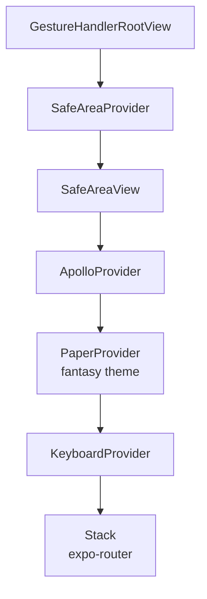

# Mobile App

Expo React Native app under `mobile-app/`, targeting iOS, Android, and Web from a single codebase.

## Stack

- **Expo** `~54` + **React Native** `0.81` + **TypeScript`.
- **expo-router** `~6` — file-based routing.
- **react-native-paper** — Material Design components. Themed via a custom "fantasy" theme (`theme/fantasyTheme.ts`).
- **@apollo/client** `^4` — GraphQL client.
- **@supabase/supabase-js** — auth.
- Animations: `react-native-reanimated`, `react-native-gesture-handler`.
- Fonts: Google "Spectral" via `@expo-google-fonts/spectral` (loaded in the root layout).

## Route structure

```
mobile-app/app/
├── _layout.tsx                       # Root providers: Apollo, Paper, SafeArea, Gesture, Keyboard, Stack
├── index.tsx                         # Redirect → /characters
├── apolloClient.ts                   # Apollo client + cache + Supabase auth link
├── (auth)/                           # Unauthenticated screens
│   ├── sign-in.tsx
│   └── sign-up.tsx
├── (rail)/                           # Drawer-based main app (requires auth)
│   ├── _layout.tsx                   # expo-router Drawer
│   ├── characters.tsx                # Roster
│   ├── subclasses.tsx                # Custom subclass manager
│   ├── spells.tsx                    # Spell library
│   ├── settings.tsx
│   └── character/
│       └── [id].tsx                  # Character sheet (pager: core / abilities / features / gear / spells / traits)
├── characters/
│   └── create/                       # Multi-step create-character wizard
│       ├── _layout.tsx
│       ├── index.tsx                 # Identity (name + race)
│       ├── race.tsx                  # Redirect → identity (kept for compatibility)
│       ├── class.tsx
│       ├── abilities.tsx
│       ├── background.tsx
│       ├── skills.tsx
│       └── review.tsx
└── spells/
    └── [id].tsx                      # Spell detail
```

Two route groups at the top level:

- `(auth)` — sign-in/up screens. No session required.
- `(rail)` — the authenticated drawer app. The layout in [`@/home/ted/projects/5e-companion/mobile-app/app/(rail)/_layout.tsx:1-49`](../mobile-app/app/(rail)/_layout.tsx) mounts an `expo-router/drawer` with a custom `ExpandedDrawer` on mobile and uses a collapsed rail on tablet widths (see `components/navigation/`).

The root stack in [`@/home/ted/projects/5e-companion/mobile-app/app/_layout.tsx:117-134`](../mobile-app/app/_layout.tsx) defines screen-to-screen transitions; note `characters/create` and `spells/[id]` use `slide_from_right`.

## Providers

Root layout wraps every screen in (outer → inner):



Any screen can assume these are available. The character-creation wizard wraps its own `CharacterDraftProvider` on top.

## Apollo client

- Created in [`@/home/ted/projects/5e-companion/mobile-app/app/apolloClient.ts:1-45`](../mobile-app/app/apolloClient.ts).
- Two links: `authLink` (adds `Authorization: Bearer <jwt>` from the current Supabase session) → `httpLink` (points at `EXPO_PUBLIC_API_URL`).
- Cache has **one field policy**: `Character.spellbook` uses `merge: false`, because the server returns the full snapshot on any spellbook change and partial merging would clobber deletions.
- Shared GraphQL documents live in `mobile-app/graphql/` (primarily `characterSheet.operations.ts`, `customSubclass.operations.ts`, and `spell.fragments.ts`). One-shot queries/mutations are colocated in their screen.

GraphQL operation types are generated into `mobile-app/types/generated_graphql_types.ts` via `bun app:codegen`. The codegen scans `app/**/*.tsx`, `components/**/*.tsx`, and `graphql/**/*.ts` — extend `mobile-app/codegen.yml` if you put docs elsewhere.

## State management

- **Apollo cache** for server data.
- **React Context** for short-lived multi-screen flows:
  - `store/characterDraft.tsx` — holds the in-progress character during creation.
  - The level-up wizard state lives in `useLevelUpWizard` (a single hook) rather than a provider, since it's scoped to one sheet.
- **`useState` / `useMemo`** for local UI concerns.

No Redux, Zustand, Jotai, etc.

## Navigation helpers

- `hooks/useProtectedNavigation.ts` — navigate only if a session exists.
- `app/_layout.tsx` — app-wide auth gate; checks the stored Supabase session, listens for auth-state changes, and redirects between auth/protected routes.
- `hooks/useSessionGuard.ts` — focused screen-level session checks and manual re-checks, including post-sign-in checks.
- `components/navigation/navigationConstants.ts` — single list of drawer destinations plus the `isNavigationDestinationActive()` helper that knows `/character/:id` should count as the "Characters" section.
- The authenticated rail includes `/subclasses`, a subclass manager that lists visible subclasses in one filtered view. Tapping a row expands it in-place to show the full description while fading out sibling rows, filters, and the add button; custom rows expose edit/delete actions in a full-width footer. User-owned subclass rows can be created, edited, and archived.

## Theming

Entry point: [`@/home/ted/projects/5e-companion/mobile-app/theme/fantasyTheme.ts`](../mobile-app/theme/fantasyTheme.ts).

- `fantasyTokens` — raw design tokens (colours, motion durations, rail widths, breakpoints). Exported so any file can read them without touching the full theme object.
- `buildFantasyTheme(colorScheme)` — returns a react-native-paper theme with the fantasy palette injected.
- `fantasyTokens.breakpoints.tablet` gates tablet-vs-phone layouts.

Rule of thumb: pull colours and spacing from `fantasyTokens` rather than inlining hex codes.

## Platform forks

TypeScript resolves module suffixes from `tsconfig.json`:

```
"moduleSuffixes": [".web", ".native", ""]
```

Metro does the same. So a component can ship `Foo.web.tsx` and `Foo.native.tsx` — see `components/character-sheet/CharacterSheetPager.*` for a real example. Keep `moduleSuffixes` in sync with any new variants you add.

## Shared UI primitives

High-reuse components live at `components/` (flat), with folders for sub-domains:

| Folder | What it's for |
| --- | --- |
| `components/` (top level) | Generic UI (ActionButton, ConfirmDialog, TextField, SpellList, etc.) |
| `components/character-sheet/` | The character sheet screens and their cards |
| `components/character-sheet/level-up/` | The level-up wizard UI |
| `components/character-sheet/spells/` | Spellbook, spell slots, add-spell sheet |
| `components/character-sheet/gear/` | Inventory + weapons |
| `components/character-sheet/features/` | Features list |
| `components/character-sheet/edit-mode/` | Edit-mode framing |
| `components/navigation/` | Drawer + rail |
| `components/sheets/` | Shared bottom-sheet frames and sheet-level primitives |
| `components/subclasses/` | Custom subclass manager cards, rows, filters, and form sheet |
| `components/wizard/` | Shared wizard pieces (WizardShell, OptionGrid, AlignmentGrid, ability-score inputs) |
| `components/spell-list/` | SpellList subcomponents |
| `components/characters/` | Character roster cards |

Before adding a new component, **grep for the thing you're about to build** — see [`conventions.md`](./conventions.md).

## Testing (pointer)

Jest + jest-expo, Playwright e2e. See [`testing.md`](./testing.md).
