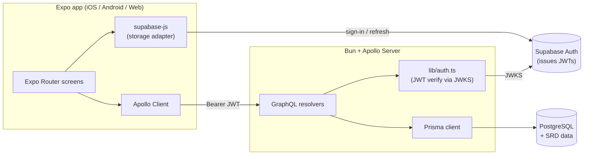

# Overview

A Dungeons & Dragons 5th-edition companion app for use at the table: browse/search/filter spells, create and manage characters (HP, spell slots, inventory), and run common in-play actions (short/long rest, death saves, level-up).

The project is also a learning playground for React Native, Apollo GraphQL, and agentic AI tooling — see the disclaimer in [`../README.md`](../README.md).

## What's in the repo

Monorepo, two deployable pieces plus shared data:

| Path | What it is |
| --- | --- |
| `mobile-app/` | Expo React Native app (iOS, Android, Web) |
| `server/` | Apollo GraphQL server (Bun runtime) + Prisma + PostgreSQL |
| `srd-json-files/` | Source-of-truth SRD JSON (spells, classes, features, etc.) consumed by the seed |
| `supabase/` | Local Supabase stack config (used for auth + e2e) |
| `.github/workflows/` | CI: unit tests, lint, Playwright e2e |
| `AGENTS.md` | Project rules, conventions, and running-commands cheat sheet |

## Tech stack

| Layer | Choice | Notes |
| --- | --- | --- |
| Mobile UI | **Expo** (`expo@~54`) + React Native 0.81 + TypeScript | `expo-router` for file-based routing; `react-native-paper` for Material components |
| Mobile data | **Apollo Client 4** | In-memory cache with field policies (see [`@/home/ted/projects/5e-companion/mobile-app/app/apolloClient.ts:1-45`](../mobile-app/app/apolloClient.ts)) |
| API | **Apollo Server 5** standalone | Runs on Bun (`bun --watch index.ts`) |
| Database | **PostgreSQL 18** via Docker | `server/docker-compose.yml` |
| ORM | **Prisma 7** | Schema at `server/prisma/schema.prisma` |
| Auth | **Supabase Auth** (JWT) | Server verifies JWT via Supabase JWKS (`jose`) |
| Package managers | **Bun** (server + root), **Yarn** (mobile) | Historical reason: Expo + Bun had issues |
| Tests | **Jest** (mobile), **bun test** (server), **Playwright** (e2e) | CI runs all three |

## High-level architecture

See [`architecture.md`](./architecture.md) for the request lifecycle and more detail.

## Top-level features

- **Spell library** — browse/filter SRD + custom spells, open details. Spellbook + slot tracking on each character.
- **Character creation wizard** — multi-step Expo Router flow (see [`features/character-creation.md`](./features/character-creation.md)).
- **Character sheet** — core stats, HP, death saves, hit dice, skills, abilities, inventory, weapons, features, spell slots.
- **Level-up wizard** — per-class level bump with ASI/feat, subclass selection, spellcasting updates, etc. (see [`features/level-up-wizard.md`](./features/level-up-wizard.md)).
- **Rests** — short / long rest mutations to recover resources server-side.
- **Custom subclasses** — the create + level-up flows allow user-defined subclasses stored alongside SRD rows.

## What this project is **not** (yet)

- Not multi-user collaborative — each character belongs to a single `ownerUserId`.
- No Monster manual, encounter tracker, or dice-rolling UI.
- Not offline-first — Apollo cache only, no persistence.
- No deployment — runs locally against local Postgres + local Supabase.
